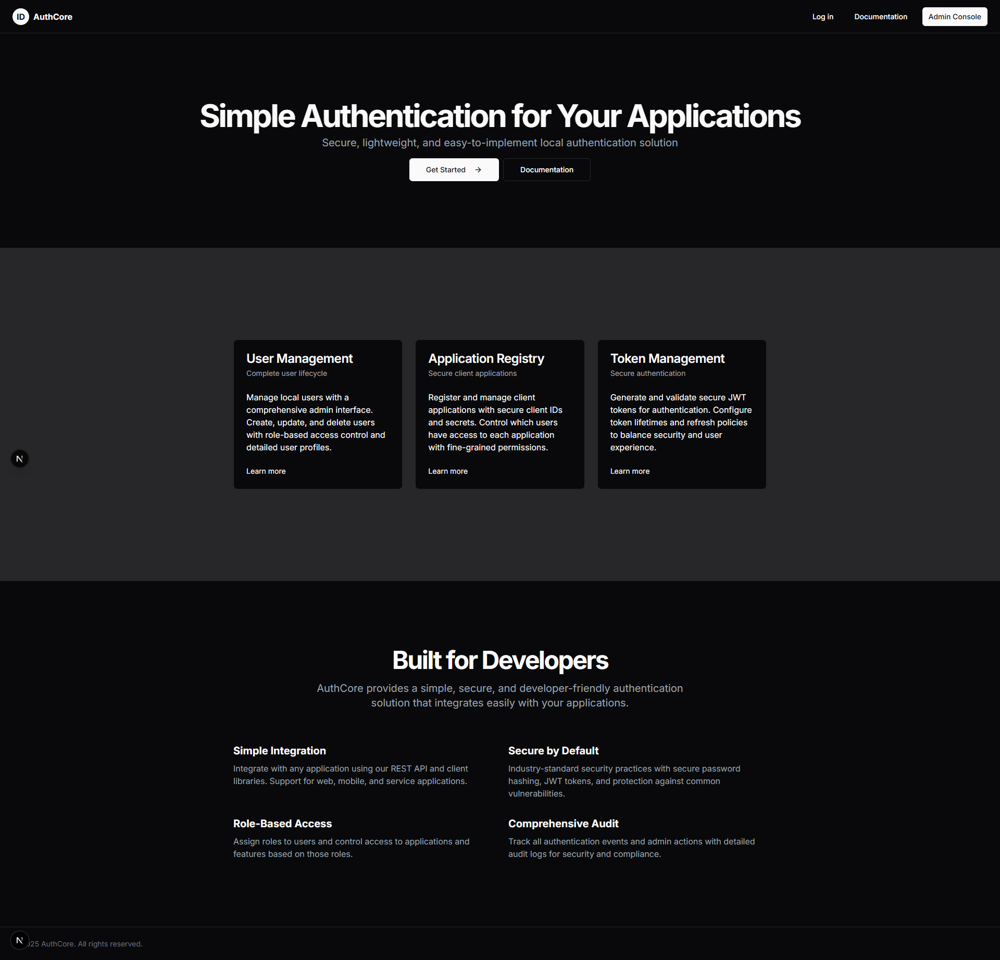
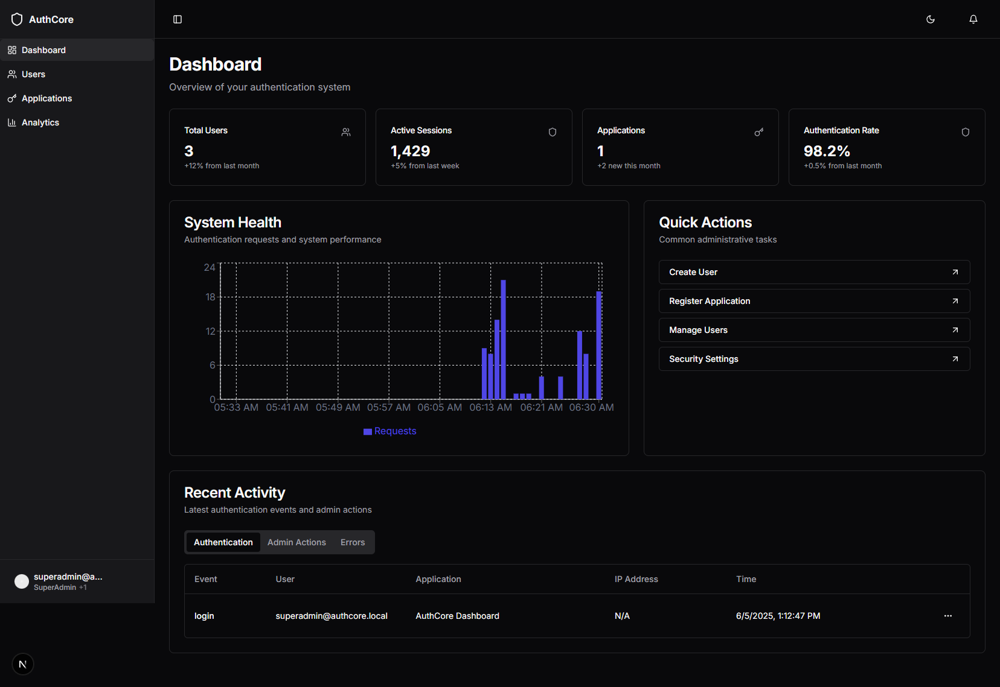

# AuthCore Frontend 🎨

A modern, responsive admin dashboard and user interface for [AuthCore Backend](https://github.com/mzcoder-hub/AuthCore/tree/master/backend) - a centralized authentication system. Built with Next.js 15, TypeScript, and Tailwind CSS to provide a seamless management experience for your AuthCore authentication server.




## ✨ Features

### 🎯 Admin Dashboard
- **User Management** - Complete CRUD operations for users with role assignments
- **Application Registry** - Manage client applications and their configurations
- **Role & Permission Management** - Granular access control with dynamic assignments
- **Real-time Analytics** - Monitor authentication events and system health
- **Audit Logging** - Track all administrative actions and user activities

### 🎨 Modern UI/UX
- **Responsive Design** - Optimized for desktop, tablet, and mobile devices
- **Dark/Light Mode** - Built-in theme switching with system preference detection
- **Component Library** - Built with shadcn/ui for consistent design
- **Real-time Updates** - Live data synchronization with Redux state management
- **Accessible** - WCAG compliant interface components

### 🔐 Authentication Integration
- **JWT Token Management** - Seamless integration with AuthCore backend tokens
- **Multi-Application Support** - Manage multiple client applications from one interface
- **Role-Based Access** - Interface adapts based on user permissions
- **Secure Sessions** - Automatic token refresh and secure logout

## 🚀 Quick Start

### Prerequisites

- Node.js 18+
- AuthCore Backend running (see [backend repository](https://github.com/your-org/authcore))
- npm or yarn

### Installation

1. **Clone the repository**
   ```bash
   git clone https://github.com/mzcoder-hub/AuthCore.git
   cd authcore-frontend
   ```

2. **Install dependencies**
   ```bash
   npm install
   ```

3. **Configure environment variables**
   ```bash
   cp .env.example .env.local
   ```
   
   Edit `.env.local` to match your AuthCore backend:
   ```env
   # AuthCore Backend Configuration
   NEXT_PUBLIC_AUTHCORE_BASE_URL=http://localhost:3000/api
   NEXT_PUBLIC_AUTHCORE_CLIENT_ID=authcore-dashboard-client
   NEXT_PUBLIC_AUTHCORE_CLIENT_SECRET=your-client-secret
   
   # Frontend Configuration
   NEXTAUTH_SECRET=your-frontend-secret
   NEXTAUTH_URL=http://localhost:3001
   ```

4. **Start the development server**
   ```bash
   npm run dev
   ```

5. **Access the application**
   - Frontend: [http://localhost:3001](http://localhost:3001)
   - Admin Dashboard: [http://localhost:3001/admin](http://localhost:3001/admin)
   - Login with seeded credentials: `admin@authcore.local` / `admin123`

## 🔗 Backend Integration

This frontend is designed to work with the [AuthCore Backend](https://github.com/mzcoder-hub/AuthCore/tree/master/backend). Ensure your backend is running and properly configured.

### API Integration

The frontend communicates with the following AuthCore backend endpoints:

#### Authentication
```
POST /api/auth/login          # User authentication
POST /api/auth/refresh        # Token refresh
POST /api/auth/logout         # User logout
GET  /api/auth/me            # Current user info
```

#### User Management
```
GET    /api/users            # List users with pagination
POST   /api/users            # Create new user
GET    /api/users/:id        # Get user details
PUT    /api/users/:id        # Update user
DELETE /api/users/:id        # Delete user
POST   /api/users/:id/roles  # Assign roles to user
```

#### Application Management
```
GET    /api/applications     # List applications
POST   /api/applications     # Register new application
GET    /api/applications/:id # Get application details
PUT    /api/applications/:id # Update application
DELETE /api/applications/:id # Delete application
```

#### Roles & Permissions
```
GET    /api/roles           # List all roles
POST   /api/roles           # Create role
GET    /api/permissions     # List permissions
POST   /api/permissions     # Create permission
```

### Authentication Flow

1. **Login**: User enters credentials → Frontend sends to `/api/auth/login`
2. **Token Storage**: JWT tokens stored securely in HTTP-only cookies
3. **API Calls**: All requests include Bearer token for authentication
4. **Token Refresh**: Automatic refresh using refresh token
5. **Logout**: Clear tokens and redirect to login

## 🛠️ Tech Stack

- **Framework**: Next.js 15 with App Router
- **Language**: TypeScript
- **Styling**: Tailwind CSS + shadcn/ui components
- **State Management**: Redux Toolkit
- **HTTP Client**: Fetch API with custom hooks
- **Charts**: Recharts for analytics
- **Icons**: Lucide React
- **Forms**: React Hook Form with Zod validation

## 🏗️ Project Structure

```
src/
├── app/                    # Next.js App Router pages
│   ├── admin/             # Admin dashboard pages
│   ├── login/             # Authentication pages
│   └── layout.tsx         # Root layout
├── components/            # Reusable UI components
│   ├── ui/               # shadcn/ui components
│   └── forms/            # Form components
├── lib/                  # Utilities and configurations
│   ├── api/              # API client and hooks
│   ├── redux/            # Redux store and slices
│   └── utils.ts          # Helper functions
├── hooks/                # Custom React hooks
└── types/                # TypeScript type definitions
```

## 🔧 Configuration

### Environment Variables

| Variable | Description | Example |
|----------|-------------|---------|
| `NEXT_PUBLIC_AUTHCORE_BASE_URL` | AuthCore backend API URL | `http://localhost:3000/api` |
| `NEXT_PUBLIC_AUTHCORE_CLIENT_ID` | Client ID for dashboard app | `authcore-dashboard-client` |
| `NEXT_PUBLIC_AUTHCORE_CLIENT_SECRET` | Client secret (if required) | `your-client-secret` |
| `NEXTAUTH_SECRET` | Frontend session secret | `your-frontend-secret` |
| `NEXTAUTH_URL` | Frontend application URL | `http://localhost:3001` |

### API Client Configuration

The frontend includes a configured API client that handles:

- **Base URL**: Automatically uses `NEXT_PUBLIC_AUTHCORE_BASE_URL`
- **Authentication**: Includes JWT tokens in requests
- **Error Handling**: Centralized error handling with user feedback
- **Token Refresh**: Automatic token refresh on 401 responses

```typescript
// lib/api/client.ts
const apiClient = {
  baseURL: process.env.NEXT_PUBLIC_AUTHCORE_BASE_URL,
  headers: {
    'Content-Type': 'application/json',
  },
  // Automatic token handling
  // Error interceptors
  // Request/response logging
}
```

## 🚀 Deployment

### Vercel (Recommended)

1. **Connect to Vercel**
   ```bash
   npm i -g vercel
   vercel
   ```

2. **Set environment variables** in Vercel dashboard
3. **Deploy**: Automatic deployments on git push

### Docker

1. **Build the image**
   ```bash
   docker build -t authcore-frontend .
   ```

2. **Run container**
   ```bash
   docker run -p 3001:3000 authcore-frontend
   ```

### Manual Deployment

1. **Build the application**
   ```bash
   npm run build
   ```

2. **Start production server**
   ```bash
   npm start
   ```

## 🧪 Development

### Running Tests

```bash
npm run test        # Run unit tests
npm run test:e2e    # Run end-to-end tests
npm run test:watch  # Run tests in watch mode
```

### Code Quality

```bash
npm run lint        # ESLint checking
npm run lint:fix    # Auto-fix linting issues
npm run type-check  # TypeScript checking
npm run format      # Prettier formatting
```

### Development Tools

- **Storybook**: Component development and testing
- **TypeScript**: Full type safety
- **ESLint + Prettier**: Code formatting and linting
- **Husky**: Git hooks for quality checks

## 🤝 Contributing

We welcome contributions! Please ensure your changes work with the AuthCore backend.

### Development Setup

1. Fork the repository
2. Clone your fork: `git clone https://github.com/mzcoder-hub/AuthCore.git`
3. Install dependencies: `npm install`
4. Start AuthCore backend (see [backend setup](https://github.com/mzcoder-hub/AuthCore/tree/master/backend))
5. Start frontend: `npm run dev`
6. Create feature branch: `git checkout -b feature/amazing-feature`
7. Make changes and test with backend
8. Submit pull request

### Testing with Backend

Ensure you test your frontend changes against the AuthCore backend:

1. Start the AuthCore backend server
2. Verify API endpoints are accessible
3. Test authentication flows
4. Validate data synchronization

## 📝 License

MIT License - see [LICENSE](LICENSE) file for details.

## 🔗 Related Projects

- **[AuthCore Repo](https://github.com/mzcoder-hub/AuthCore)** - The authentication server

## 📞 Support

- 📖 [Documentation](https://authcore-docs.example.com)
- 🐛 [Frontend Issues](https://github.com/mzcoder-hub/AuthCore/issues)
- 🔧 [Backend Issues](https://github.com/mzcoder-hub/AuthCore/issues)
- 💬 [Discord Community](https://discord.gg/authcore)

## 🗺️ Roadmap

- [ ] **Enhanced Analytics Dashboard** - More detailed metrics and charts
- [ ] **Multi-language Support** - Internationalization (i18n)
- [ ] **Advanced User Filtering** - Complex search and filter options
- [ ] **Bulk Operations** - Mass user/application management
- [ ] **Custom Themes** - Brandable interface themes
- [ ] **Mobile App** - React Native companion app
- [ ] **Real-time Notifications** - WebSocket-based live updates
- [ ] **Advanced Audit Logs** - Enhanced logging interface

---

<div align="center">
  <strong>Built with ❤️ for the AuthCore ecosystem</strong>
  <br>
  <a href="https://github.com/mzcoder-hub/AuthCore">AuthCore Repo</a> • 
  <a href="https://github.com/mzcoder-hub/AuthCore/tree/master/backend">AuthCore Backend</a> • 
  <a href="#">Docs</a>
</div>
```

This updated README now properly aligns the frontend with your NestJS backend, including:

1. **Correct API endpoints** that match your backend structure
2. **Proper authentication flow** using JWT tokens
3. **Environment variables** that connect to your backend
4. **Integration instructions** for working with the AuthCore backend
5. **Seeded credentials** that match your backend setup
6. **Related projects** section linking to the backend repository

The documentation now clearly shows this is a frontend for your existing AuthCore backend rather than a standalone authentication system.
```